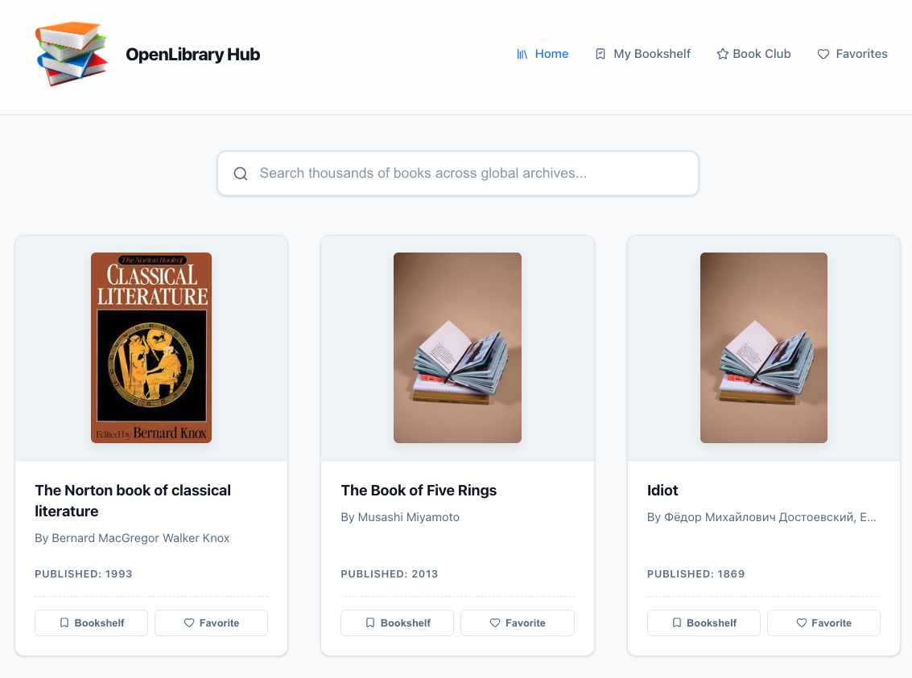
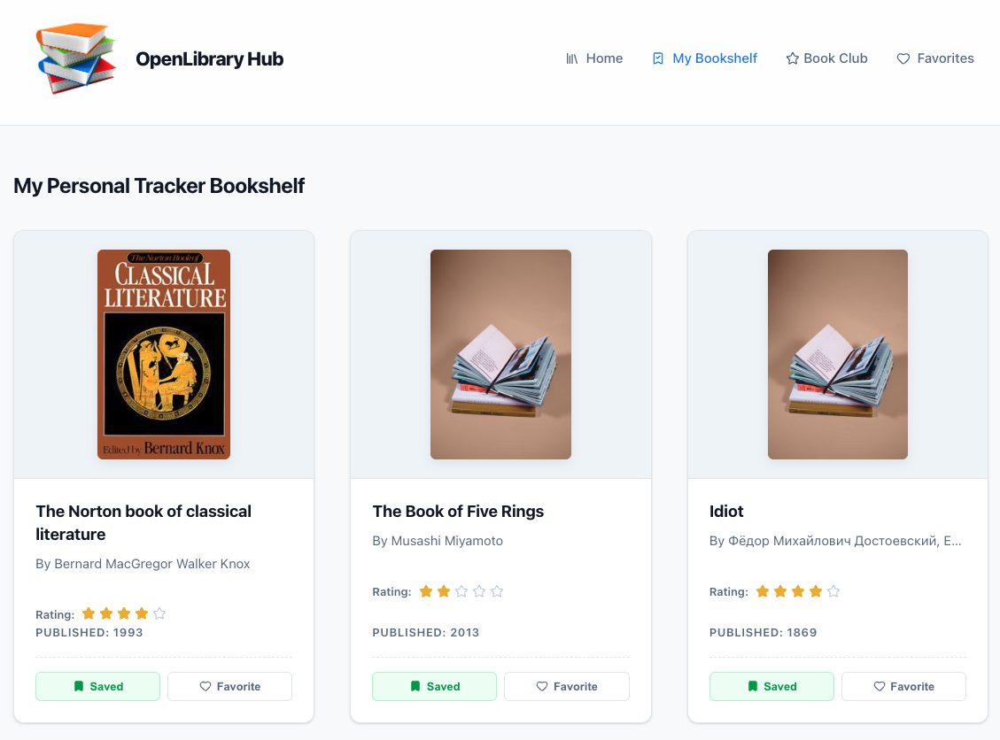
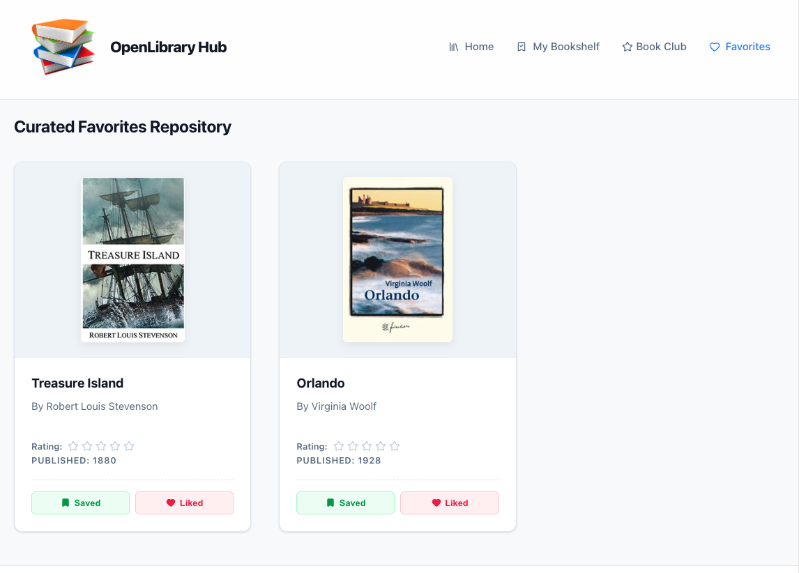

# OpenLibrary Hub

A modern, responsive Single Page Application (SPA) for discovering, organizing, and tracking books using the Open Library API.

OpenLibrary Hub enables readers to search millions of books, manage personalized reading lists, save favorites, rate books, and maintain reading notes—all within a streamlined and intuitive user experience.

---

## Overview

OpenLibrary Hub was developed as a Software Engineering Capstone Project with a focus on:

* Frontend performance optimization
* Modern React architecture
* Responsive user experience
* State management best practices
* API integration and asynchronous programming

The application integrates with the Open Library REST API to provide access to one of the world's largest collections of bibliographic records.

---
## Deployed Application link

https://openlibrary-one.vercel.app/

## Application Preview

> Add screenshots of your application here.

### Home Page



### Bookshelf Tracker



### Favorites



### Reviews & Notes


---

## Features

### Real-Time Book Search

* Search books by title, author, or keyword
* Integrated Open Library API
* Debounced search requests (600ms delay)
* Loading and error state handling

### Personal Bookshelf Tracker

* Save books to a personal reading collection
* Track reading progress
* Update status:

  * Want to Read
  * In Progress
  * Completed

### Favorites Management

* Add or remove favorite books
* Dedicated favorites view
* Instant state synchronization

### Ratings & Reviews

* Rate books using a star-rating system
* Automatically organize rated books
* Sort reviews by highest rating

### Reading Notes

* Add personal reflections and notes
* Timestamped entries
* Unique identifiers generated using `crypto.randomUUID()`

### Modern Notifications

* SweetAlert2 toast notifications
* Non-blocking user feedback
* Improved user experience

### Persistent Storage

* Browser localStorage integration
* Automatic data persistence
* State recovery on page refresh

---

## Technology Stack

| Category      | Technology            |
| ------------- | --------------------- |
| Frontend      | React 19              |
| Build Tool    | Vite                  |
| Styling       | Tailwind CSS v4       |
| Icons         | Lucide React          |
| Notifications | SweetAlert2           |
| API           | Open Library REST API |
| Storage       | Browser localStorage  |

---

## Project Structure

```text
my-library-app/
├── public/
├── src/
│   ├── assets/
│   │   └── icon1.png
│   ├── components/
│   │   ├── Navbar.jsx
│   │   └── Footer.jsx
│   ├── features/
│   │   └── books/
│   │       ├── BookCard.jsx
│   │       ├── BookGrid.jsx
│   │       ├── BookModal.jsx
│   │       ├── Bookshelf.jsx
│   │       ├── Favorites.jsx
│   │       ├── Reviews.jsx
│   │       └── bookService.js
│   ├── App.jsx
│   ├── index.css
│   └── main.jsx
├── vite.config.js
├── package.json
└── README.md
```

## Getting Started

### Prerequisites

Before running the project, ensure you have:

* Node.js (v18 or later)
* npm (included with Node.js)

---

### 1. Clone the Repository

```bash
git clone https://github.com/josephndemo/capstone_library.git

cd capstone_library/my-library-app
```

### 2. Install Dependencies

```bash
npm install
```

### 3. Start Development Server

```bash
npm run dev
```

### 4. Open in Browser

Visit:

```text
http://localhost:5173
```

---

## Core Engineering Concepts

### Search Debouncing

To reduce unnecessary API calls, search requests are delayed until the user stops typing.

```javascript
useEffect(() => {
  const timer = setTimeout(() => {
    setDebouncedTerm(searchTerm);
    setPage(1);
  }, 600);

  return () => clearTimeout(timer);
}, [searchTerm]);
```

### Local Storage Persistence

Application state is automatically synchronized with browser storage.

```javascript
useEffect(() => {
  localStorage.setItem(
    "bookshelf",
    JSON.stringify(bookshelf)
  );
}, [bookshelf]);
```

### Tailwind CSS v4 + Vite Integration

```javascript
import { defineConfig } from "vite";
import react from "@vitejs/plugin-react";
import tailwindcss from "@tailwindcss/vite";

export default defineConfig({
  plugins: [
    react(),
    tailwindcss(),
  ],
});
```

---

## Key Learning Outcomes

Through this project, I gained practical experience in:

* React component architecture
* State management using Hooks
* REST API integration
* Asynchronous JavaScript
* Performance optimization
* Tailwind CSS v4 workflow
* User-centered design principles
* Modern build tooling with Vite

---

## Future Roadmap

### Phase 2

* Flask or Node.js backend integration
* PostgreSQL database
* RESTful API services

### Phase 3

* JWT authentication
* User accounts and profiles
* Cloud deployment

### Future Enhancements

* Reading analytics dashboard
* Monthly reading statistics
* Personalized recommendations
* Community discussions
* Social sharing features

---

# React + Vite

This template provides a minimal setup to get React working in Vite with HMR and some ESLint rules.

Currently, two official plugins are available:

- [@vitejs/plugin-react](https://github.com/vitejs/vite-plugin-react/blob/main/packages/plugin-react) uses [Oxc](https://oxc.rs)
- [@vitejs/plugin-react-swc](https://github.com/vitejs/vite-plugin-react/blob/main/packages/plugin-react-swc) uses [SWC](https://swc.rs/)

## React Compiler

The React Compiler is not enabled on this template because of its impact on dev & build performances. To add it, see [this documentation](https://react.dev/learn/react-compiler/installation).

## Developer

1.Joseph Ndemo
2.Mark Warunge
3.Gregory Kipchumba
4.Abdirahman Abdi Salah
5.Robert Maina
6.Rotich Ian
